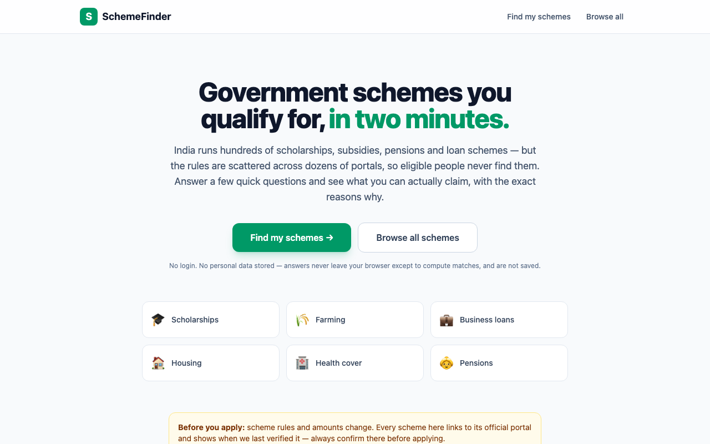
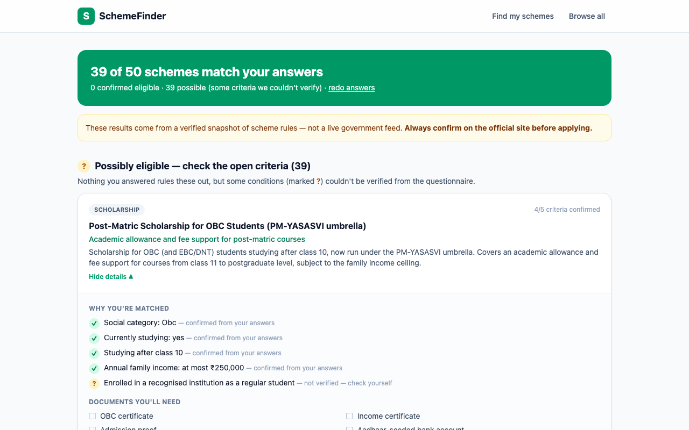
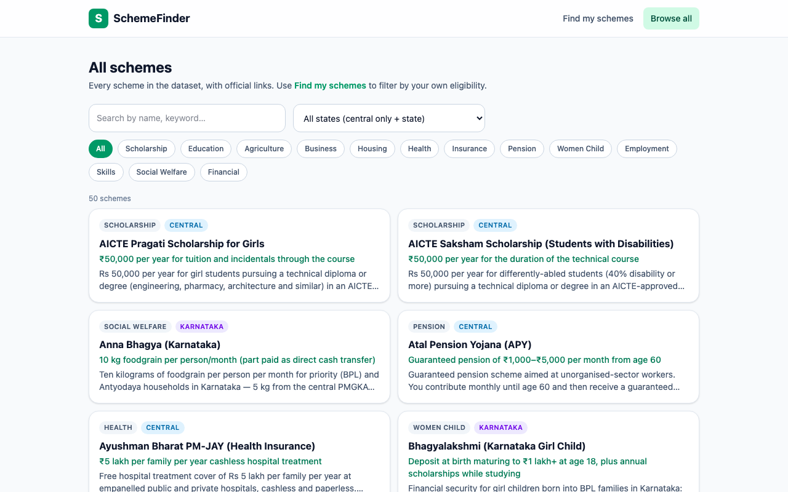

# SchemeFinder

**Find the Indian government schemes you actually qualify for — in two minutes, with the reasons why.**

India runs hundreds of scholarships, subsidies, pensions, insurance and loan schemes. The information exists, but it's scattered across dozens of portals, written in dense officialese, and organised by ministry rather than by *person*. The result is a discovery problem with real cost: an SC student who'd get her degree fees covered, a street vendor entitled to a ₹50,000 loan, or a 70-year-old who now gets free ₹5-lakh health cover often simply never find out.

SchemeFinder turns that around: you describe yourself once (8–11 quick questions, all skippable), and a transparent rules engine checks you against a verified dataset of 50 central and Karnataka schemes — showing exactly **which criteria passed, which couldn't be verified, and why**.

| | | |
|---|---|---|
|  |  |  |

## How it works

### The dataset (the hard part)

Every scheme lives in one YAML file under [`backend/data/schemes/`](backend/data/schemes/), curated from official sources — ministry portals, `myscheme.gov.in`, `scholarships.gov.in`, Seva Sindhu — with the source URL and a `last_verified` date kept on every entry. Eligibility is **structured data, not free text**:

```yaml
eligibility:
  rules:
    - field: category          # closed vocabulary of 15 profile fields
      op: eq
      value: sc
    - field: annual_income
      op: lte                  # all numeric comparisons are inclusive
      value: 250000
    - field: education_level
      op: in
      value: [higher_secondary, diploma_iti, undergraduate, postgraduate, doctorate]
  self_check:                  # real criteria the questionnaire can't verify
    - "Enrolled in a recognised institution as a regular student"
```

Two design decisions matter here:

- **A closed field vocabulary.** Rules may only reference 15 known profile fields (age, state, income, category, occupation…). The validator rejects anything else, which keeps the dataset, engine and questionnaire mechanically in sync.
- **`self_check` for honesty.** Plenty of real criteria ("holds a vending certificate", "first pregnancy", "house has no LPG connection") can't be captured by a short questionnaire. Rather than dropping them (overclaiming) or asking 40 questions, they're listed as explicit unverified items — and their presence caps the result at *possibly eligible*.

`python -m scripts.validate_data` checks every file against the schema (field vocabulary, operator/value types, enum membership, state consistency, unique IDs) and refuses to seed a database from an invalid dataset.

### The eligibility engine

[`backend/app/engine.py`](backend/app/engine.py) is a small pure-functional core. Each criterion evaluates to **pass / fail / unknown** — a missing answer is *unknown*, never a guess — and the combination never overclaims:

| Criteria outcome | Scheme result |
|---|---|
| any **fail** | not eligible |
| no fail, any **unknown** (incl. self-check items) | possibly eligible |
| all **pass** | eligible |

`any_of` groups handle real OR-logic (Stand-Up India: *SC/ST **or** woman entrepreneur*): the group passes if any branch passes, fails only when **every** branch fails, and stays unknown otherwise — a mix of fail + unknown must not fail, because the unknown branch might still pass.

**Example.** Profile: 21-year-old OBC woman in Karnataka, family income ₹2,00,000, studying for a bachelor's degree. Against the OBC post-matric scholarship:

```
✓ Social category: OBC            — confirmed from your answers
✓ Currently studying: yes         — confirmed
✓ Studying after class 10         — confirmed
✓ Annual family income ≤ ₹2,50,000 — confirmed
? Enrolled as a regular student   — not verified, check yourself
→ POSSIBLY ELIGIBLE (score 4/5)
```

Results are ranked: eligible before possibly-eligible, then by fraction of confirmed criteria, then benefit size. Boundary semantics are explicit and tested — income exactly at a ₹2,50,000 ceiling **passes**, age exactly 18 passes an "18+" rule.

### The API

```
GET  /api/health             liveness + scheme count
GET  /api/meta               vocabularies for filters/questions, disclaimer
GET  /api/schemes            browse; ?category= &state= &q= &tag=
GET  /api/schemes/{id}       full scheme detail
POST /api/match              {profile} in → ranked matches with per-criterion traces
```

Profiles are validated (unknown states/enum values are 422s with a consistent `{"error": {code, message, details}}` envelope), evaluated in memory, and **never stored** — there are no accounts and no analytics.

## Running it

```bash
docker compose up --build
# frontend → http://localhost:3000   backend → http://localhost:8000/docs
```

That starts Postgres, validates + seeds the 50-scheme dataset, and serves the React app.

For local development:

```bash
# backend (Python 3.12+)
cd backend
python3 -m venv .venv && .venv/bin/pip install -r requirements-dev.txt
DATABASE_URL=sqlite:///dev.db .venv/bin/python -m scripts.seed
DATABASE_URL=sqlite:///dev.db .venv/bin/uvicorn app.main:app --reload

# frontend (Node 20+) — proxies /api to :8000
cd frontend
npm install && npm run dev
```

### Tests

```bash
cd backend && .venv/bin/python -m pytest        # 61 tests
.venv/bin/python -m scripts.validate_data       # dataset validation
```

The engine suite pins every operator at its boundaries (age exactly at a limit, income exactly at a ceiling), `any_of` mixed states, empty profiles, and the self-check cap. API tests run the real YAML dataset through an in-memory database and assert on the same envelope and matches the UI consumes.

## Data sourcing & verification

- Only schemes verifiable from an **official source** are included; each entry keeps its source URL(s) and a `last_verified` date.
- Where a criterion's official wording is fuzzy or list-based (SECC deprivation, "poor household"), the entry uses a conservative rule plus a self-check item instead of pretending precision.
- Amounts shown are the headline figures from the official source (e.g. PM-KISAN ₹6,000/yr; KCC limit ₹5 lakh after the 2025 budget revision).
- The UI repeats on every surface: **verify on the official site before applying.**

## Limitations

- **Schemes change.** This dataset is a verified snapshot, not a live feed. Income ceilings, amounts and even whole schemes are revised every budget cycle.
- **Coverage is 50 schemes** — all-India flagships plus Karnataka's major programmes. A real deployment needs every state and several hundred entries.
- The questionnaire models one applicant at a time; household-level criteria (e.g. "any family member with a government job") are self-check items rather than asked questions.
- English only, for now — the target user often isn't an English reader.

## What I'd build next

1. **More states** — the schema already handles state-level schemes; each new state is pure data work.
2. **Auto-sync monitors** — scrapers that diff official portal pages against the dataset and open a review PR when a ceiling or amount changes, so `last_verified` stays honest.
3. **Regional languages** — Kannada and Hindi first; the structured criteria make rule labels mechanically translatable.
4. **Household profiles** — ask once about the family, evaluate every member (girl-child schemes, senior pensions, student scholarships from one questionnaire).
5. **Document deep-links** — each required document (caste certificate, income certificate) linked to *its* application process, since documents are their own discovery problem.
